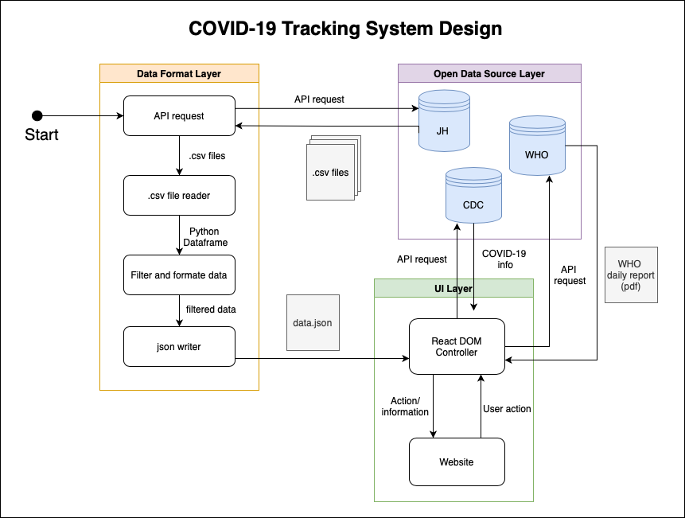

# COVID-19 Tracking System
#### Authors
+ Dongchen Ye - [LinkedIn](https://www.linkedin.com/in/dongchenye/) - [GitHub](https://github.com/dongchenye).

+ Dongqing Ye- [LinkedIn](https://www.linkedin.com/in/dongqingye/) - [GitHub](https://github.com/dongqingye7).

## Table of Contents

[What is *COVID-19 Tracking System*?](#intro)    
[Why is this important?](#importance)    
[*COVID-19 Tracking System* Workflow](#workflow)    
[Quickstart](#quickstart)    
[Installing *COVID-19 Tracking System*](#install)    
[Running *COVID-19 Tracking System*](#running)    
[*Optional* ViruSpy Testing and Validation](#testing_and_validation)    
[*Optional* Additional Functionality](#additional)    

## What is *COVID-19 Tracking System*?

This project is a web application that aims to visualize and track reported cases of coronavirus disease COVID-19 in real time and provides the general public, exspecially for travelers, with disease guidance and important travel advices. 

It includes following features:

+ Case in US weekly/monthly Analysis 
+ US Map for confirmed case location
+ State cases details (categorizing by State)
+ Travel Advice (categorizing by Country)
+ WHO Daily Reports (categorizing by date)
+ About COVID-19 

This projects uses open data source from [Centers for Disease Control and Prevention(CDC)](https://www.cdc.gov/coronavirus/2019-nCoV/summary.html), [Johns Hopkins University Center for Systems Science and Engineering (JHU CSSE)](https://github.com/CSSEGISandData/COVID-19), and [Word Health Organization(WHO)](https://www.who.int/emergencies/diseases/novel-coronavirus-2019/situation-reports). Whenever the system starts running, it will fetch the real-time data from these open data source and update accordingly. The data including the location and number of confirmed COVID-19 cases, deaths, and recoveries will be updated everyday.

## Why is this important?

In December 2019, an outbreak of respiratory disease caused by a novel (new) coronavirus that was first detected in China and which has now been detected in almost 90 locations internationally, including in the United States. 

In response to this ongoing public health emergency, we developed this project to provide a user-friendly tool to track the outbreak as it unfolds. The real-time information analysis reveals the rapid spreading of the disease which will certainly have a great impact on the public’s “movement“. 

It is important to ensure easy accessibility of such information for both domestic and international travelers for decision making. We believe our effort in building the COVID-19 Tracking System makes this information accessible and crucial to help people stay aware and prevent, well in advance, from suffering health problems during the earliest stages of the outbreak.

## *COVID-19 Tracking System* Workflow

Write about how the project was completed, including assumptions made, how any data was joined or parsed, and other features explaining functionality, design, and workflow. Include any dependencies. Write in layman's terms.

### 1. System Design

### 2. Web Page Structure

#### Dashboard
This "Dashboard" page aims to provide an overview of COVID-19 outbreak in US. The data is updated daily.

It shows the following informations:
+ Total number of Confirmed Cases(US)
+ Total number of Deaths Cases(US)
+ Total number of Recovered Cases(US)

+ Weekly Cumulative Cases Tracking (line chart)
    + Confirmed
    + Deaths
    + Recovered

+ Monthly New Reported Cases Tracking (bar chart)
    + Confirmed
    + Deaths
    + Recovered

#### US Map
This "US Map" page aims to provide a visiualized overview of the locations in US that have confirmed cases. The data is updated daily.

#### State Cases
This "State Cases" page aims to provide a table with detailed information for cases categorized by State/County. User can sort the rows based on the attribute selected.
The data is updated daily.

Each rows includes following information:
+ State
+ County
+ Confirmed
+ Deaths
+ Recovered

#### Travel Advice

This "Travel Advice" page aims to provide the crucial travel information or travelers and travel related industries. This includes information of the countries with different risk assessment level for COVID-19 according to Centers for Disease Control and Prevention(CDC), and it also provides links to the CDS Travel Information. 
The data is updated daily.

#### WHO Daily Report
This "WHO Daily Report" page aims to provide daily updated Situation reports from Word Health Organization(WHO). User can select date from the calender on the right to view the corresponding WHO report. 

#### About COVID-19
This "About COVID-19" page aims to provide the general information about Coronavirus Disease 2019 (COVID-19) according to Centers for Disease Control and Prevention(CDC). 

It shows the following informations:
+ What is a Conronavirus (COVID-19)?
+ Source and spread of virus.

## Installing *COVID-19 Tracking System*
Write the full steps for installation for someone who is not a programmer, including links and steps for additional tools they need to have for your project to work.

Required software
+ Node.js  - Download and install Node.js from [NodeJS Downloads](https://nodejs.org/en/download/)
+ 

Install *COVID-19 Tracking System*:
1. Go to [Github COVID-19-Tracking-System](https://github.com/dongqingye7/COVID-19-Tracking-System) and download the zip file.
2. Unzip the zipfile
3. Open a command line terminal, go to this `./COVID-19-Tracking-System` folder 
4. Type in command line with following code:  `python3 data_formater.py` (this will create a data.json file in the ./scr folder)
5. Type in command line with following code:  `npm install`
6. Type in command line with following code:  `npm install @material-ui/core @material-ui/icons`
7. Type in command line with following code:  `npm start`
 

##  Running *COVID-19 Tracking System*

## ViruSpy Testing and Validation

## Additional Functionality

