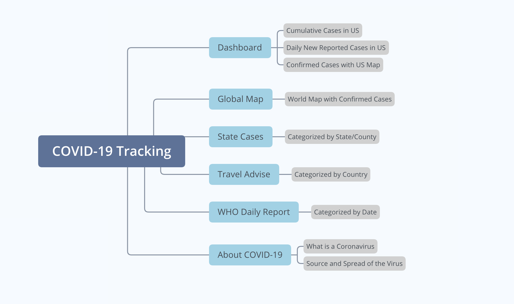

# COVID-19 Tracking System
#### Authors
+ Dongchen Ye - [LinkedIn](https://www.linkedin.com/in/dongchenye/) - [GitHub](https://github.com/dongchenye).

+ Dongqing Ye- [LinkedIn](https://www.linkedin.com/in/dongqingye/) - [GitHub](https://github.com/dongqingye7).


Team members names and links to profiles (websites, LinkedIn, GitHub, Twitter, etc.)

## Table of Contents

[What is *COVID-19 Tracking System*?](#intro)    
[Why is this important?](#importance)    
[*COVID-19 Tracking System* Workflow](#workflow)    
[Quickstart](#quickstart)    
[Installing *COVID-19 Tracking System*](#install)    
[Running *COVID-19 Tracking System*](#usage)    
[*Optional* ViruSpy Testing and Validation](#testing_and_validation)    
[*Optional* Additional Functionality](#additional)    

## <a name="intro"></a>What is *COVID-19 Tracking System*?

Be sure to describe the project, what your open data source is, and how the idea came about. Write in layman's terms, and link to the original data source.

This project is a web application that aims to visualize and track reported cases of coronavirus disease COVID-19 in real time and provides the general public, exspecially for travelers, with disease guidance and important travel advices. 

It includes following features:

+ Case in US weekly/monthly Analysis 
+ US Map for confirmed case location
+ State cases details (categorizing by State)
+ Travel Advice (categorizing by Country)
+ WHO Daily Reports (categorizing by date)
+ About COVID-19 

This projects uses open data source from [Centers for Disease Control and Prevention(CDC)](https://www.cdc.gov/coronavirus/2019-nCoV/summary.html), [Johns Hopkins University Center for Systems Science and Engineering (JHU CSSE)](https://github.com/CSSEGISandData/COVID-19), and [Word Health Organization(WHO)](https://www.who.int/emergencies/diseases/novel-coronavirus-2019/situation-reports). Whenever the system starts running, it will fetch the real-time data from these open data source and update accordingly. The data including the location and number of confirmed COVID-19 cases, deaths, and recoveries will be updated everyday.


## <a name="importance"></a>Why is this important?

Write about the significance of the project and how it relates to the hackathon theme.

In December 2019, an outbreak of respiratory disease caused by a novel (new) coronavirus that was first detected in China and which has now been detected in almost 90 locations internationally, including in the United States. 

In response to this ongoing public health emergency, we developed this project to provide a user-friendly tool to track the outbreak as it unfolds. The real-time information analysis reveals the rapid spreading of the disease which will certainly have a great impact on the public’s “movement“. 

It is important to ensure easy accessibility of such information for both domestic and international travelers for decision making. We believe our effort in building the COVID-19 Tracking System makes this information accessible and crucial to help people stay aware and prevent, well in advance, from suffering health problems during the earliest stages of the outbreak.

## <a name="workflow"></a>*COVID-19 Tracking System* Workflow

Write about how the project was completed, including assumptions made, how any data was joined or parsed, and other features explaining functionality, design, and workflow. Include any dependencies. Write in layman's terms.

### System Design


### Web Page Structure




## <a name="install"></a>Installing ViruSpy
Write the full steps for installation for someone who is not a programmer, including links and steps for additional tools they need to have for your project to work.

Required software
+ List here
+ List here


## <a name="testing_and_validation"></a>ViruSpy Testing and Validation

## <a name="additional"></a>Additional Functionality


```python

```
